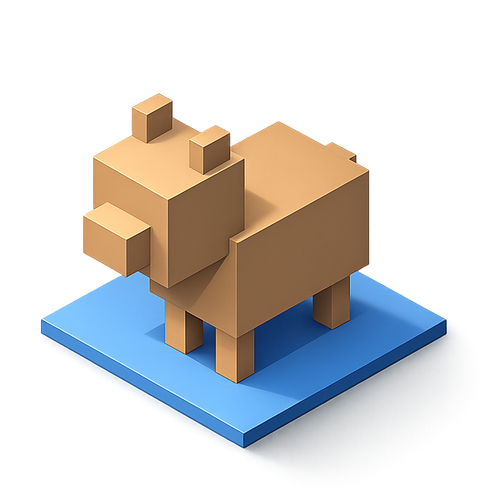

# BearCAD 

<p align="left">
  
</p>

Local-first, parametric CAD. Built by robots.

## Download

| Platform | Download |
|----------|----------|
| macOS (Apple Silicon) | [bearcad.dmg](https://github.com/iffy/BearCAD/releases/latest/download/bearcad.dmg) |
| Windows (x86_64) | [bearcad.exe](https://github.com/iffy/BearCAD/releases/latest/download/bearcad.exe) |
| Linux (x86_64) | [bearcad-linux-x86_64.tar.gz](https://github.com/iffy/BearCAD/releases/latest/download/bearcad-linux-x86_64.tar.gz) |

## Docs

Full documentation — a tool-by-tool GUI/navigation reference and the Lua scripting API — lives in
[`docs-site/`](docs-site/) (a [Docusaurus](https://docusaurus.io/) site) and publishes to
[iffy.github.io/BearCAD](https://iffy.github.io/BearCAD/) via GitHub Pages once enabled in repo
settings. Run it locally with:

```sh
cd docs-site && npm install && npm start
```

## Status

- **GUI** with a **wgpu**-accelerated 3D viewport (orbit/pan/zoom, view cube, HUD bear).
- **Sketch tools** on construction planes and face-hosted sketches: **rectangle**, **line**,
  and **circle**.
- **Construction geometry**: construction planes, per-edge construction flags, dashed
  construction lines.
- **Dimension constraints** on lines, rectangle edges, and circle diameters; draggable
  dimension labels.
- **Named parameters** with unit expressions (`mm`, `in`, arithmetic, parameter references).
- **Elements tree**, **Context** pane, **Parameters** table, and **command palette**.
- **Save / Open** documents as `.bearcad` files (SQLite, per SPEC §7).
- **Lua scripts** (SPEC §8): drive the live UI from a `.lua` file.

Not yet implemented: OCCT B-rep kernel, action DAG, assemblies, and the full CLI
from SPEC §9 (`--help` and script mode work today).

## Run

```sh
cargo run
```

- Pick a face with the **Sketch** tool (or start on the default XY construction plane),
  then draw with **Rectangle**, **Line**, or **Circle**.
- Type dimensions while drawing; **Tab** cycles fields; **Enter** commits.
- **Right-drag** to orbit; **Shift+right-drag** to pan; **mouse wheel** to zoom.
- **Escape** cancels an in-progress draw; press again to exit sketch mode or return to
  Select.
- **Save / Save As…** writes a `.bearcad` SQLite file; **Open…** loads one back.
- **Clear** resets the document; **Undo last** removes the most recently committed shape.

```sh
cargo run -- --help    # usage and exit
cargo test
```

## Building with the OCCT kernel

BearCAD's real BREP geometry kernel is [OpenCASCADE (OCCT)](https://dev.opencascade.org/),
linked in behind the **`occt`** Cargo feature. The feature is **off by default** —
the standard `cargo build` / `cargo test` above need no C++ toolchain and no OCCT,
so day-to-day development and CI are unaffected. Build with the kernel like this:

```sh
# 1. Fetch the pinned OCCT source (once):
git submodule update --init --depth 1 third_party/OCCT

# 2. Build OCCT as static libraries (needs cmake + a C++17 compiler; takes a while):
scripts/build-occt.sh

# 3. Build/run BearCAD with the kernel linked in:
cargo run --features occt
```

`scripts/build-occt.sh` builds only the modeling toolkits (no visualization or
data-exchange modules) into `third_party/OCCT/occt-install`, which `build.rs`
statically links against.

### Recompiling against a different OCCT version

BearCAD links OCCT **statically**. The LGPL 2.1 permits this on the condition that
you can relink the app against a different (e.g. modified or newer) OCCT. To do
so, point the **`OCCT_DIR`** environment variable at any OCCT install prefix — one
containing `include/opencascade/*.hxx` and `lib/libTK*.a` — and rebuild:

```sh
OCCT_DIR=/path/to/your/occt-install cargo build --features occt
```

When `OCCT_DIR` is set it takes precedence over the bundled submodule build, so
you can swap in your own OCCT (from Homebrew, a distro package, or a custom build)
without touching BearCAD's source. See
[`THIRD_PARTY_LICENSES.md`](THIRD_PARTY_LICENSES.md) for the full licensing story.

## Script quickstart

Scripts are **Lua** files (`.lua`) that call the global `bearcad` API. They drive the same
actions and synthetic input as the GUI, which makes them useful for automation and
regression tests.

**Run a script and quit when it finishes:**

```sh
cargo run -- --script examples/rectangle.lua --exit
# same thing:
cargo run -- examples/rectangle.lua --exit
```

**Minimal script** — the primary API is *declarative* (OpenSCAD-style): describe geometry
directly instead of simulating clicks. An 80×50 mm rectangle is a single call:

```lua
bearcad.new()
-- Enters a ground-plane sketch if none is open, then makes the rectangle.
bearcad.rect{ width = 80, height = 50, name = "Main box" }
```

**GUI/UI manipulation** (simulated mouse/keyboard, camera, tools, panes) lives under the
`bearcad.ui.*` sub-namespace, kept separate so scripts can focus on modeling. Prefer the
declarative API; reach for `bearcad.ui.*` only when the UI interaction is the point:

```lua
bearcad.ui.tool("rectangle")
bearcad.ui.click_ground(0, 0)     -- millimetres on the active sketch plane
bearcad.ui.move_ground(80, 50)
bearcad.ui.view("front")          -- bearcad.ui.click(x, y) uses viewport pixels instead
```

**Named elements** — set a name when creating geometry or after committing a sketch shape,
then look it up later:

```lua
-- Programmatic create with name:
bearcad.begin_sketch("construction_plane", 0)
bearcad.rect({ width = 80, height = 50, name = "Main box" })

-- Or name after interactive draw:
bearcad.set_name(bearcad.element("rect", 0), "Main box")
local box = bearcad.find("Main box")
bearcad.select(box)
```

More examples: [examples/rectangle.lua](examples/rectangle.lua),
[examples/line.lua](examples/line.lua).

The Lua bindings live in `src/lua_script.rs`; the internal instruction runner is in
`src/script.rs`.

## Lua API reference

Declarative modeling/document functions are on the global `bearcad` table; GUI/UI
manipulation lives under `bearcad.ui.*` (see "Camera, UI, and input" below). Call
`bearcad.import()` once at the top of a script to copy the top-level modeling functions into
the global namespace, so you can write `new()` instead of `bearcad.new()` (the `bearcad.ui.*`
functions stay namespaced). You can also bind individual functions with `local new, rect =
bearcad.new, bearcad.rect`.

Scripts run in a coroutine; calls that need to wait (`bearcad.ui.wait`, `bearcad.ui.wait_ms`,
`bearcad.ui.screenshot`, camera `bearcad.ui.view` commands) yield until the next frame.

### Document

| Function | Description |
|---|---|
| `bearcad.new()` | New empty document |
| `bearcad.open(path)` | Open a document (no file dialog) |
| `bearcad.save()` / `bearcad.save(path)` | Save / Save As |
| `bearcad.clear()` | Reset the document |
| `bearcad.undo()` | Undo the last committed shape |
| `bearcad.quit()` | Close the app when the script ends |

### Tools and sketching

| Function | Description |
|---|---|
| `bearcad.ui.tool("rectangle")` | Select a tool (`select`, `line`, `circle`, `sketch`, …) — UI |
| `bearcad.begin_sketch("construction_plane", 0)` | Start sketching on a face |
| `bearcad.open_sketch(0)` | Re-open an existing sketch |
| `bearcad.exit_sketch()` | Leave the active sketch |

### Elements and names

| Function | Description |
|---|---|
| `bearcad.element("rect", 0)` | Reference an element by kind and index |
| `bearcad.find("Name")` | Look up an element by custom name (or `nil`) |
| `bearcad.set_name(element, "Name")` | Set or rename an element |
| `bearcad.select(element)` | Select an element (`{ additive = true }` to add) |
| `bearcad.clear_selection()` | Clear scene selection |
| `bearcad.set_visible(element, "hide")` | Show / hide / toggle visibility |
| `bearcad.set_construction(element, true)` | Mark element or edge as construction |
| `bearcad.rect({ width=80, height=50, name="Box" })` | Create a rectangle (optional `name`) |
| `bearcad.line({ length=80, name="Guide" })` | Create a line (optional `name`) |

Element kinds: `construction_plane`, `sketch`, `rect`, `line`, `circle`, `constraint`.
Pass a table `{ kind = "rect", index = 0, edge = "bottom" }` when an edge is needed.

### Dimensions and constraints

| Function | Description |
|---|---|
| `bearcad.set_dim("width", "80")` | Set a dimension while drawing |
| `bearcad.ui.focus_dim("length")` | Focus a dimension field — UI |
| `bearcad.edit_dim("width")` / `bearcad.commit_dim()` | Edit a committed dimension label |
| `bearcad.add_constraint({ kind="line", index=0 }, "25mm")` | Add a distance constraint |
| `bearcad.add_geometric_constraint("parallel")` | Add a geometric constraint |
| `bearcad.ui.drag_vertex({ kind="line", index=0, end="end" }, u, v)` | Drag a constrained point — UI |
| `bearcad.ui.drag_line({ kind="line", index=0 }, au, av, u, v)` | Drag a line segment — UI |

### Parameters

| Function | Description |
|---|---|
| `bearcad.parameter("add", "A", "5mm")` | Add a named parameter |
| `bearcad.parameter("value", 0, "A + 5in")` | Set a parameter expression |
| `bearcad.parameter("name", 0, "Len")` | Rename a parameter |
| `bearcad.parameter("delete", 1)` | Delete a parameter |

### Camera, UI, and input (`bearcad.ui.*`)

All GUI/UI manipulation is under the `bearcad.ui` sub-namespace.

| Function | Description |
|---|---|
| `bearcad.ui.orbit(dx, dy)` / `bearcad.ui.pan(dx, dy)` | Camera motion |
| `bearcad.ui.wheel(scroll)` | Mouse wheel zoom |
| `bearcad.ui.view("front")` | Standard view (waits for animation) |
| `bearcad.ui.view("edge", "front_top")` | View-cube edge |
| `bearcad.ui.view_home()` | Return to home view |
| `bearcad.ui.pane("hierarchy", "hide")` | Show / hide / toggle a pane |
| `bearcad.ui.palette("run", "view top")` | Run a palette command |
| `bearcad.ui.click(x, y)` / `bearcad.ui.move(x, y)` | Synthetic viewport input |
| `bearcad.ui.click_ground(x, y)` | Click on sketch plane (mm) |
| `bearcad.ui.key("enter")` / `bearcad.ui.type("12.5")` | Keyboard / text input |
| `bearcad.ui.wait(5)` | Wait 5 UI frames |
| `bearcad.ui.wait_ms(100)` | Wait 100 milliseconds |
| `bearcad.ui.screenshot("out.png")` | Capture the viewport |

Use `cargo run -- --show-commands` to echo GUI actions as `bearcad.*` calls on stdout.